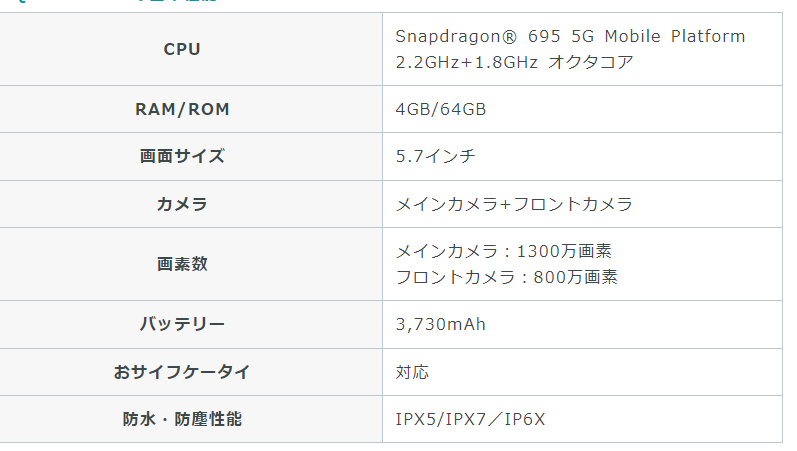
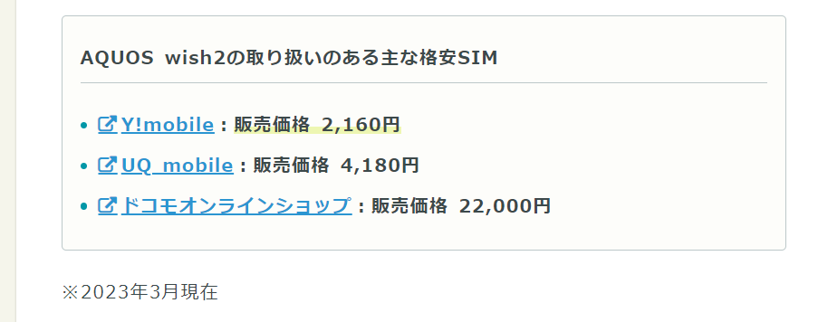
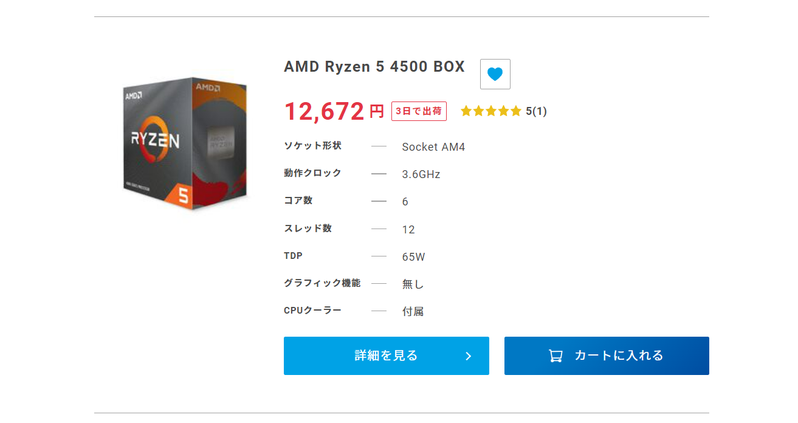
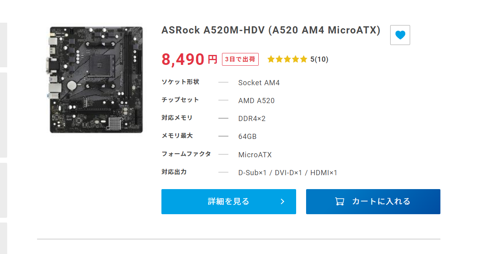
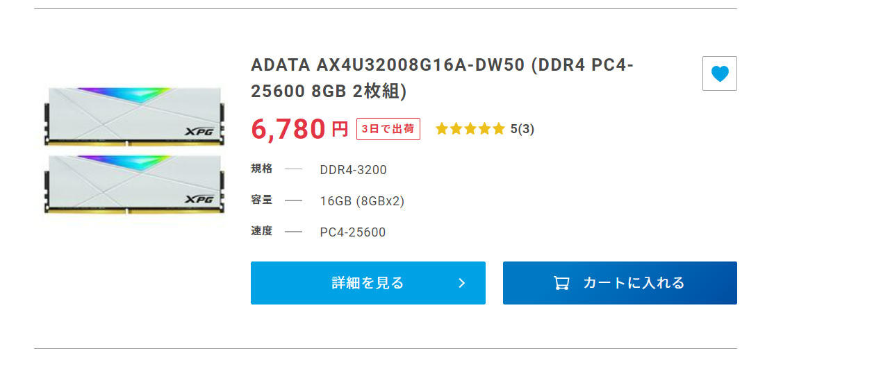
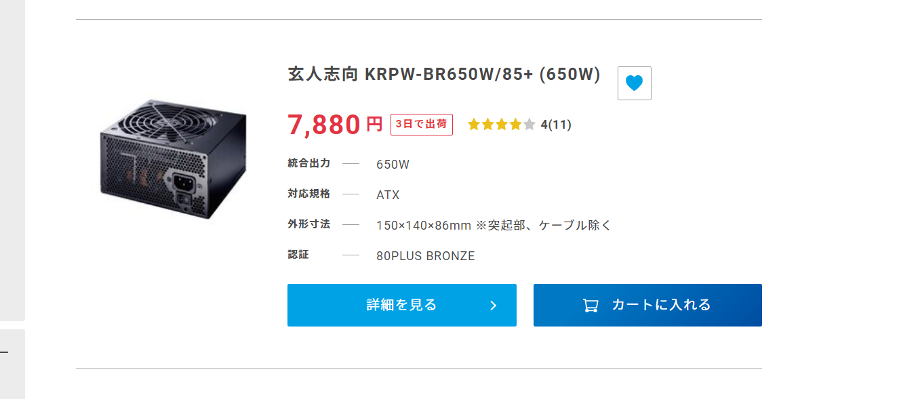
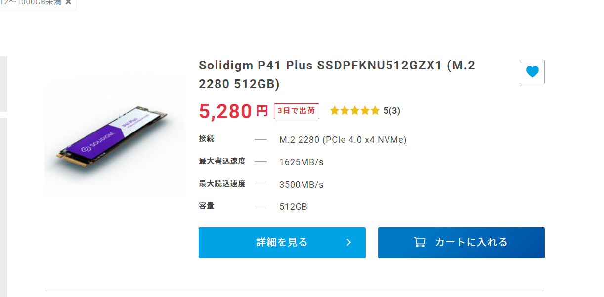
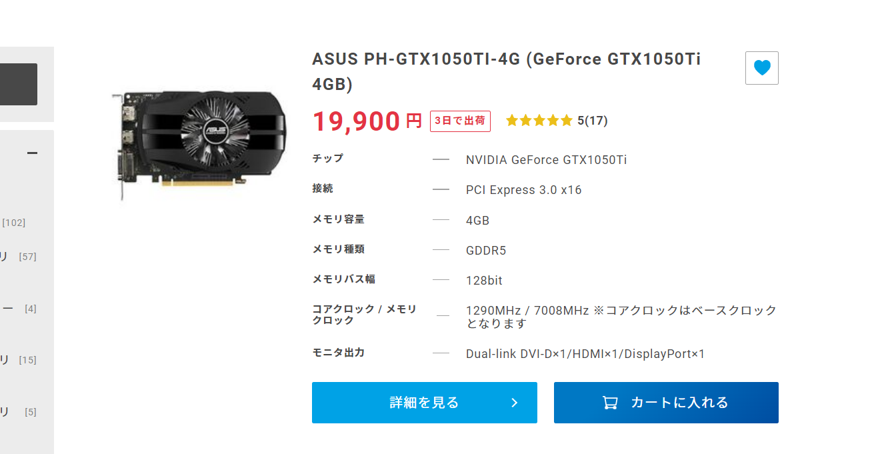

# NewPC

## smartPhone

https://hikkoshizamurai.jp/soldi/articles/good-cospa_simfree/

SHARP「AQUOS wish2」

***

## Sayaka PC

### CPU性能比較サイト

https://pcfreebook.com/article/450856544.html

#### CPU

#### MB

#### メモリ

#### 電源

#### SSD 

#### グラボ（妥協）

***

## Napa`memory

napa@napa-dynabook-R73-D:~$ sudo dmidecode --type memory
[sudo] napa のパスワード: 
# dmidecode 3.2
Getting SMBIOS data from sysfs.
SMBIOS 2.8 present.

Handle 0x0007, DMI type 16, 23 bytes
Physical Memory Array
	Location: System Board Or Motherboard
	Use: System Memory
	Error Correction Type: None
	Maximum Capacity: 16 GB
	Error Information Handle: Not Provided
	Number Of Devices: 2

Handle 0x0008, DMI type 17, 40 bytes
Memory Device
	Array Handle: 0x0007
	Error Information Handle: Not Provided
	Total Width: 64 bits
	Data Width: 64 bits
	Size: 4096 MB
	Form Factor: SODIMM
	Set: None
	Locator: ChannelA-DIMM0
	Bank Locator: BANK 0
	Type: DDR3
	Type Detail: Synchronous
	Speed: 1600 MT/s
	Manufacturer: SK Hynix
	Serial Number: 01979025
	Asset Tag: 9876543210
	Part Number: HMT451S6BFR8A-PB  
	Rank: 1
	Configured Memory Speed: 1600 MT/s
	Minimum Voltage: Unknown
	Maximum Voltage: Unknown
	Configured Voltage: 1.35 V

Handle 0x0009, DMI type 17, 40 bytes
Memory Device
	Array Handle: 0x0007
	Error Information Handle: Not Provided
	Total Width: Unknown
	Data Width: Unknown
	Size: No Module Installed
	Form Factor: Unknown
	Set: None
	Locator: ChannelA-DIMM1
	Bank Locator: BANK 1
	Type: Unknown
	Type Detail: None
	Speed: Unknown
	Manufacturer: Not Specified
	Serial Number: Not Specified
	Asset Tag: Not Specified
	Part Number: Not Specified
	Rank: Unknown
	Configured Memory Speed: Unknown
	Minimum Voltage: Unknown
	Maximum Voltage: Unknown
	Configured Voltage: Unknown

Handle 0x000A, DMI type 17, 40 bytes
Memory Device
	Array Handle: 0x0007
	Error Information Handle: Not Provided
	Total Width: Unknown
	Data Width: Unknown
	Size: No Module Installed
	Form Factor: Unknown
	Set: None
	Locator: ChannelB-DIMM0
	Bank Locator: BANK 2
	Type: Unknown
	Type Detail: None
	Speed: Unknown
	Manufacturer: Not Specified
	Serial Number: Not Specified
	Asset Tag: Not Specified
	Part Number: Not Specified
	Rank: Unknown
	Configured Memory Speed: Unknown
	Minimum Voltage: Unknown
	Maximum Voltage: Unknown
	Configured Voltage: Unknown

Handle 0x000B, DMI type 17, 40 bytes
Memory Device
	Array Handle: 0x0007
	Error Information Handle: Not Provided
	Total Width: Unknown
	Data Width: Unknown
	Size: No Module Installed
	Form Factor: Unknown
	Set: None
	Locator: ChannelB-DIMM1
	Bank Locator: BANK 3
	Type: Unknown
	Type Detail: None
	Speed: Unknown
	Manufacturer: Not Specified
	Serial Number: Not Specified
	Asset Tag: Not Specified
	Part Number: Not Specified
	Rank: Unknown
	Configured Memory Speed: Unknown
	Minimum Voltage: Unknown
	Maximum Voltage: Unknown
	Configured Voltage: Unknown
